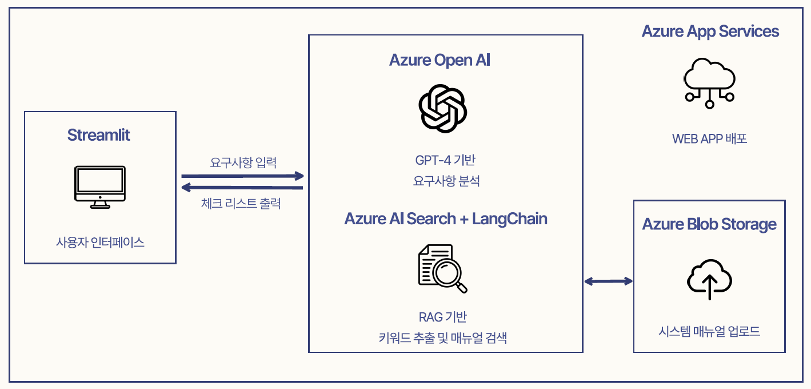
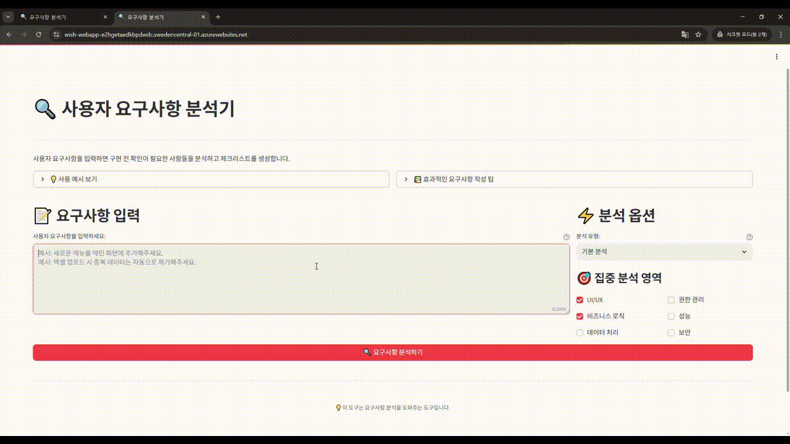
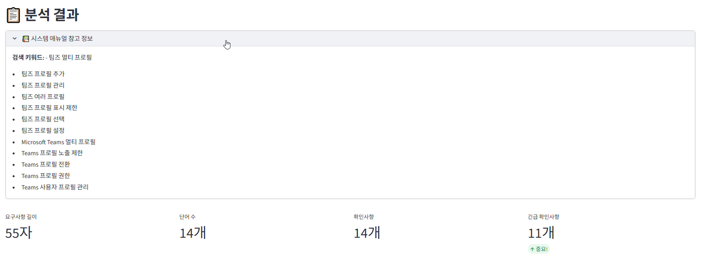
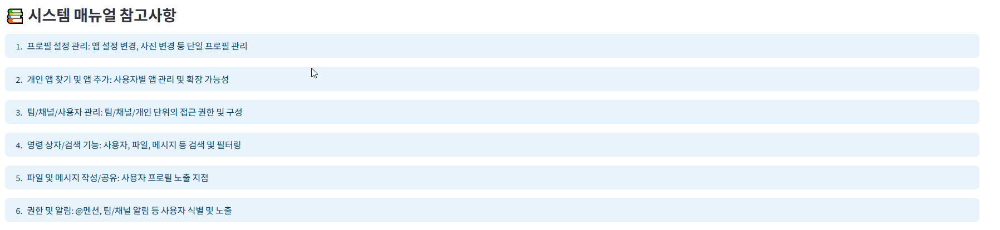
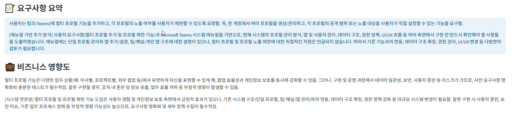
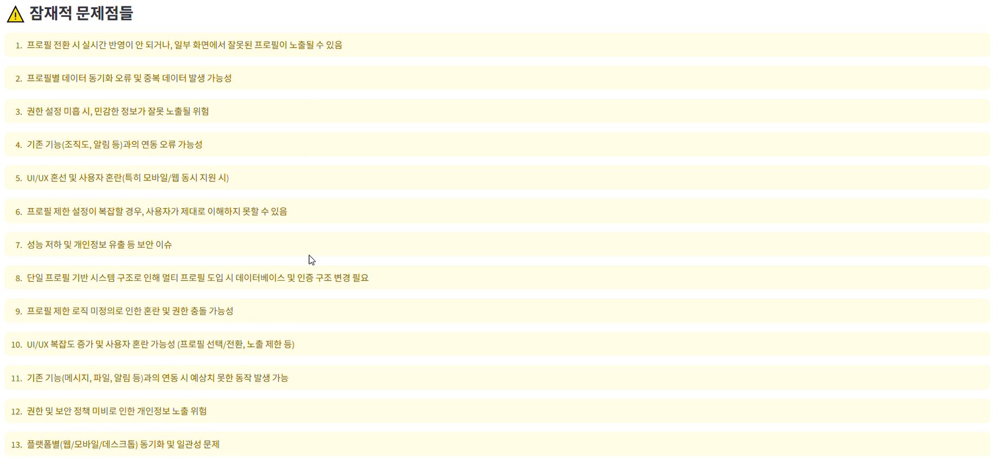
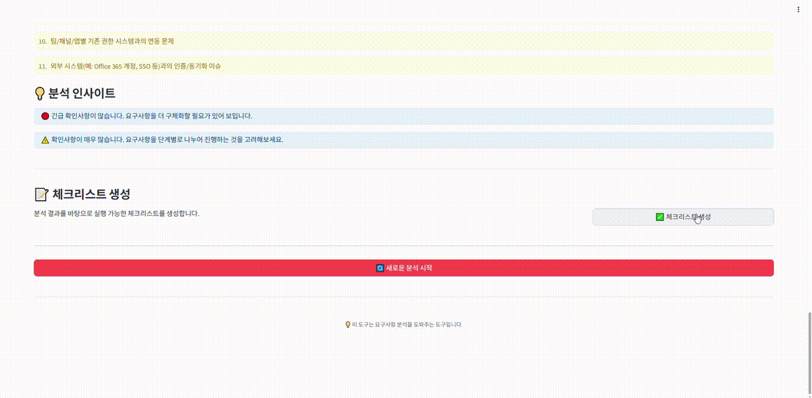

# 🔍 사용자 요구사항 분석기 (AI-Powered Requirements Analyzer)

> **AI 기반 요구사항 자동 분석 및 체크리스트 생성 시스템**
> 
> 모호한 사용자 요구사항을 AI로 분석하여 구현 전 확인해야 할 사항들을 자동으로 도출하고, 실행 가능한 체크리스트를 생성합니다.

[](https://azure.microsoft.com/)
[](https://openai.com/)
[](https://streamlit.io/)
[](https://python.org/)

## 🎯 프로젝트 개요


### 🔗 접속 링크(~25.08.08)
https://wish-webapp-e2hgetaedkbpdwdc.swedencentral-01.azurewebsites.net/

### 📋 문제 정의
- **모호한 요구사항**으로 인한 개발 지연과 반복 작업
- 구현 후 발생하는 **추가 확인사항**과 **커뮤니케이션 시간 증가**
- 기획자-개발자 간 **인식 차이**로 인한 재작업

### 💡 솔루션
- **Azure OpenAI GPT-4** 기반 요구사항 지능형 분석
- **RAG(Retrieval-Augmented Generation)** 을 활용한 시스템 매뉴얼 연동
- **실제 매뉴얼** 분석이 가능하여 정확도 향상
- 요청자와 소통시 활용할 수 있는 **실행 가능한 체크리스트** 자동 생성

## 🏗️ 시스템 아키텍처


### 🔄 데이터 흐름
1. **사용자 입력** → 요구사항 텍스트 입력
2. **키워드 추출** → AI 기반 검색 키워드 생성
3. **매뉴얼 검색** → Azure AI Search로 관련 문서 검색
4. **요구사항 분석** → GPT-4 기반 기본 분석 + 매뉴얼 기반 분석
5. **결과 통합** → 확인사항 및 체크리스트 생성

## ✨ 주요 기능

### 🎯 지능형 요구사항 분석
- **카테고리별 확인사항** 도출 (UI/UX, 비즈니스 로직, 데이터 처리 등)
- **실무 기반** 프롬프트 엔지니어링

### 🔍 RAG 기반 매뉴얼 연동
- **동적 키워드 생성**으로 관련 문서 자동 검색
- **컨텍스트 기반 분석**으로 시스템 제약사항 고려
- **매뉴얼 참조 정보** 제공

### 📋 자동 체크리스트 생성
- **담당자별 역할 분담** (기획/개발/디자인/QA)
- **개발 단계별 구분** (구현 전/중/후)
- **실행 가능한 액션 아이템** 생성

### 📊 분석 인사이트
- **요구사항 복잡도 측정**
- **위험도 평가 및 권장사항**
- **개선 포인트 제안**

## 🛠️ 기술 스택

### Backend & AI
- **Python 3.11** - 메인 개발 언어
- **Azure OpenAI GPT-4** - 요구사항 분석 및 추론
- **LangChain** - RAG 파이프라인 구현
- **Azure AI Search** - 벡터 검색 및 문서 인덱싱

### Frontend & Deployment
- **Streamlit** - 웹 인터페이스
- **Azure App Service** - 시스템 배포

### 핵심 라이브러리
```python
streamlit>=1.28.0          # UI 프레임워크
openai>=1.0.0              # Azure OpenAI 클라이언트
langchain>=0.1.0           # RAG 파이프라인
langchain-openai>=0.1.0    # OpenAI 통합
langchain-community>=0.1.0 # 커뮤니티 통합
python-dotenv>=1.0.0       # 환경변수 관리
```

## 📦 설치 및 실행

### 1. 저장소 클론
```bash
git clone https://github.com/yourusername/ai-requirements-analyzer.git
cd ai-requirements-analyzer
```

### 2. 가상환경 설정
```bash
python -m venv venv
source venv/bin/activate  # Linux/Mac
# 또는
venv\Scripts\activate     # Windows
```

### 3. 의존성 설치
```bash
pip install -r requirements.txt
```

### 4. 환경변수 설정
`.env` 파일을 생성하고 다음 내용을 입력:

```bash
# Azure OpenAI 설정
OPENAI_API_KEY=your_openai_api_key
AZURE_OPENAI_ENDPOINT=https://your-resource.openai.azure.com/
OPENAI_API_TYPE=azure
OPENAI_API_VERSION=2024-02-15-preview
AZURE_OPENAI_LLM1=your_deployment_name

# Azure AI Search 설정
AZURE_SEARCH_SERVICE_NAME=your_search_service
AZURE_AI_SEARCH_INDEX_NAME=your_index_name
AZURE_SEARCH_ADMIN_KEY=your_admin_key
AZURE_SEARCH_API_VERSION=2023-11-01
```

### 5. 애플리케이션 실행
```bash
streamlit run main.py
```

브라우저에서 `http://localhost:8501`로 접속하세요.

## 🏗️ 프로젝트 구조

```
📁 ai-requirements-analyzer/
├── 📄 main.py                 # 메인 애플리케이션
├── 📄 config.py              # 설정 및 환경변수
├── 📄 openai_client.py       # Azure OpenAI 클라이언트
├── 📄 pdf_search_client.py   # RAG 검색 클라이언트
├── 📄 result_processor.py    # 결과 처리 및 표시
├── 📄 ui_components.py       # UI 컴포넌트
├── 📄 requirements.txt       # Python 의존성
└── 📄 .env.example           # 환경변수 예시

```

## 🚀 Azure 배포

### Azure Web Apps 배포
1. **Azure CLI 설치 및 로그인**
```bash
az login
```

2. **리소스 그룹 생성**
```bash
az group create --name rg-requirements-analyzer --location "Korea Central"
```

3. **App Service 계획 생성**
```bash
az appservice plan create --name plan-requirements-analyzer --resource-group rg-requirements-analyzer --sku B1 --is-linux
```

4. **웹앱 생성**
```bash
az webapp create --name requirements-analyzer --resource-group rg-requirements-analyzer --plan plan-requirements-analyzer --runtime "PYTHON|3.9"
```

5. **환경변수 설정**
```bash
az webapp config appsettings set --name requirements-analyzer --resource-group rg-requirements-analyzer --settings OPENAI_API_KEY="your_key"
```

6. **코드 배포**
```bash
az webapp deployment source config-zip --name requirements-analyzer --resource-group rg-requirements-analyzer --src deploy.zip
```

## 💡 핵심 기술 포인트

### 🎯 커스텀 프롬프트 엔지니어링
```python
base_prompt = f"""
당신은 시스템 분석 전문가입니다. 다음 사용자 요구사항을 분석하여 
구현 전 반드시 요청자에게 확인이 필요한 사항들을 찾아주세요.

실무에서 자주 발생하는 상황들을 고려해주세요:
- "메인 화면에 추가"라고 하면 구체적인 위치와 우선순위 확인 필요
- "계약서에 적용"이라고 하면 계약 유형별 예외상황 확인 필요
- "자동으로 처리"라고 하면 실패 시 대안 처리 방안 확인 필요

다음 JSON 형식으로 응답해주세요: {{...}}
"""
```

### 🔗 하이브리드 분석 시스템
```python
def _combine_analysis_results(self, basic_analysis, manual_analysis):
    """기본 분석과 매뉴얼 기반 분석 결과를 통합"""
    combined_result = {
        "analysis_summary": f"{basic_data.get('analysis_summary', '')}\n\n[매뉴얼 기반 추가 분석]\n{manual_data.get('analysis_summary', '')}",
        "clarification_needed": basic_data.get('clarification_needed', []) + manual_data.get('clarification_needed', []),
        "manual_references": manual_data.get('manual_references', [])
    }
    return json.dumps(combined_result, ensure_ascii=False, indent=2)
```

### 🔍 RAG 파이프라인
```python
def search_manual_content(self, requirement_text):
    """매뉴얼에서 요구사항과 관련된 내용 검색"""
    # 검색 키워드 생성
    search_chain = search_prompt | self.llm | StrOutputParser()
    search_keywords = search_chain.invoke({"requirement": requirement_text})
    
    # 벡터 검색 실행
    docs = self.retriever.get_relevant_documents(search_keywords)
    
    return {
        "search_keywords": search_keywords,
        "relevant_docs": docs,
        "formatted_content": self.format_docs(docs)
    }
```

## 🚀 데모 및 스크린샷

### 📝 요구사항 분석

- 요청자의 요구사항을 입력하고 버튼을 눌러 AI 기반 분석 결과를 확인할 수 있습니다.


- 분석 결과: 요구사항에서 추출해낸 키워드와 시스템 메뉴얼 내에서 해당 키워드로 검색한 내역을 확인 가능합니다.


- 매뉴얼 참고사항: AI가 요구사항과 관련하여 매뉴얼에서 참고한 내용의 확인이 가능합니다.


- 요구사항 요약: 작성된 요구사항을 요약하여 보여줌
- 비즈니스 영향도: 해당 기능을 도입하였을 때의 시스템적 영향도를 분석합니다.
- 두 항목 모두 매뉴얼을 참고하여 분석한 결과도 제공하여 실무에 도움이 되는 인사이트를 제공합니다.


- 확인이 필요한 사항들: 구현 전 반드시 확인해야 할 사항들을 카테고리별로 정리해서 보여줍니다.
- 매뉴얼을 보고 실제 기능과 연관된 부분은 매뉴얼 참고사항을 통해 어떤 부분이 연관되었는지 확인 가능합니다.


- 잠재적 문제점들: 해당 기능을 도입했을 때 시스템에서 발생 가능한 잠재적 문제점을 분석하여 보여줍니다.

### ✅ 체크리스트 생성

- 분석된 결과를 바탕으로 개발을 진행하면서 확인해야할 부분을 체크리스트로 생성합니다.
- 개발 전, 개발 중, 개발 후, 배포 전 각 시기별로 나눠 확인하면 좋을 점을 제공해줍니다.

## 📊 성능 및 효과

### 📈 예상 효과
- **분석 및 개발 시간 단축** - 사전 확인으로 재작업 최소화
- **요구사항 품질 향상** - 평균 5-8개 확인사항 자동 도출
- **커뮤니케이션 비용 절감** - 구조화된 체크리스트 제공

### 📋 사용 예시
**입력:** "팀즈에 멀티 프로필 기능을 추가해주세요."

**분석 결과:**
- 위치 확인 (헤더/사이드바/푸터)
- 권한 설정 (전체 사용자/특정 그룹)
- 디자인 요소 (아이콘/텍스트/색상)
- 연동 방식 (팝업/새창/임베드)
- 성능 영향도 분석

## 🔮 향후 계획

### 🚀 분석 히스토리 관리
- [ ] 사용자가 이전 분석 기록을 확인할 수 있도록 DB를 활용한 히스토리 관리 기능추가

### 🌟 매뉴얼 문서 업로드 기능 고도화
- [ ] 사용자가 UI를 통해 직접 시스템의 매뉴얼을 업로드 할 수 있도록 구성


<div align="center">


</div>
